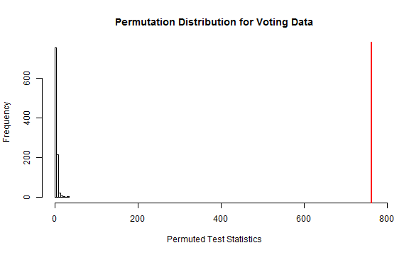
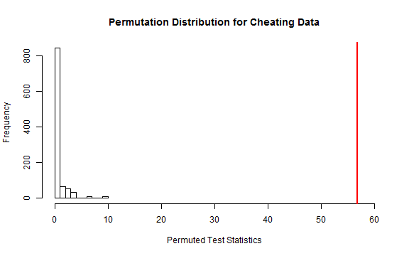

# Introduction

This activity works through Chapter 4.  It uses two datasets: the voting data (which we have covered in class) and the lying and cheating data from Section 4.9 of the book.  All tests will be done at the $\alpha = 0.05$ significance level.

Upon completing this activity, you should feel comfortable:
* determining homogeneity vs independence
* using mosaic plots
* setting up the hypotheses
* determing expected cell counts and contributions to the test statistic
* assessing the assumptions
* performing parametric and non-parametric chi-squared tests
* writing conclusions in the context of the problem
* examining residuals

There will be 6 questions for your to turn in.  Some are located throughout the activity and some are located at the end.

---
# Voting Data

A national random sample was obtained related to the 2000 Presidential Election with the party affiliations and voting results recorded for each subject.  Information on 1151 people was recorded.  Since these people were selected from the entire population of voters, and independence test is appropriate.

We will test at the $\alpha$ = 0.05 significance level.  The contingency table is presented below.


```r
require(poLCA)
data(election)  
# remove missing data
election2 <- na.omit(election[, c("PARTY", "VOTE3")])  
# recoding the variables
election2$VOTEF <- factor(election2$VOTE3)
levels(election2$VOTEF) <- c("Gore", "Bush", "Other")
# forming a contingency table
require(mosaic)
electable <- tally(~PARTY + VOTEF, data = election2)
electable
```

```
#>      VOTEF
#> PARTY Gore Bush Other
#>     1  238    6     2
#>     2  151   18     1
#>     3  113   31    13
#>     4   37   37    11
#>     5   21  124    12
#>     6   20  121     2
#>     7    3  189     1
```

Looking at the contingency table, it appears that people in Parties 1, 2, and 3 are much more likely to vote for Gore so these are probably the more liberal parties.

--- &radio
# Cheating Data

The first data set we'll work with explores student behavior.  A survey of 319 randomly selected undergraduate students at a university were asked whether they had ever lied to avoid taking an exam and if they had lied to avoid handing a paper on time.  The results are summarized below in a contingency table.

```r
require(poLCA)
require(mosaic)
data(cheating)
# turning the variables into factors
cheating$LIEEXAM <- factor(cheating$LIEEXAM, labels = c("no", "yes"))
cheating$LIEPAPER <- factor(cheating$LIEPAPER, labels = c("no", "yes"))
lietable <- tally(~LIEEXAM + LIEPAPER, data = cheating)
lietable
```

```
#>        LIEPAPER
#> LIEEXAM  no yes
#>     no  265  20
#>     yes  16  18
```

Which type of test and which type of plot should be used?

1. Independence; segmented bar chart
2. Homogeneity; segmented bar chart
3. _Independence; mosaic plot_
4. Homogeneity; mosaic plot

*** .hint
Were the subjects randomly selected from the entire population?  Or were subjects selected from within each group of students?

*** .explanation
A sample was drawn from the entire population of undergraduate students so an independence test should be used.

--- 

# Mosaic Plots

## Plot for the Voting Data

A mosaic plot of the voting data is also shown below.  It appears that not all the same groups vote for the candidates with similar probabilities so party and vote are probably related.  Furthermore, we can see that parties 1, 2, and 3 were much more likely to vote for Gore.  Parties 5, 6, and 7 were much more likely to vote for Bush.  Almost all of the "Other" votes can from parties 3, 4, and 5.


```r
mosaicplot(electable)
```


## Plot for the Cheating Data

A mosaic plot of the cheating data is shown below.  


```r
mosaicplot(lietable)
```


---
# Take Home Question #1

1) Use the mosaic plot to describe the cheating data.  Make sure that you note whether the two variables appear to be related.

--- &radio
# Hypothesis Tests

## Hypotheses for Voting data

For the voting data, our hypotheses are:

$H_0:$ There is no relationship between party affiliation and voting status in the population

$H_A:$ There is a relationship between party affiliation and voting status in the population

## Hypotheses for Cheating data

For the voting data, which is the correct null hypothesis ($H_0$)?

1. The true mean rate of lying on exams is the same for all types of students
2. _There is no relationship between lying on exams and lying on paper amongst undergradtuate students_
3. The true mean rate of lying on papers is the same for each undergraduate student
4. None of the above

*** .hint
Take a look back at the notes to see what the independence test is hypothesizing

*** .explanation
An independence test assumes that there is no relationship between the two variables in the population.

--- &checkbox
# Assumptions

Which of the following are the correct assumptions for a Chi-Squared test?  Make sure you click "Show Answer" to check that you got all of them

1. _Independence_
2. Normality
3. Equal Variance
4. _Both variables are categorical_
5. Any Expected Count
6. _Expected Counts $> 5$ for a parametric test_
7. _Expected Counts $> 0$ for a non-parametric test_

*** .hint
Remember that both variables are categorical.  So normality and equal variance don't make sense for these data.

*** .explanation
Parametric tests make stronger assumptions than non-parametric tests so we need larger expected counts for a parametric test.

--- &multitext
# Expected Counts

## Expected Counts for Voting Data

To find the expected counts for a cell under the null hypothesis, we multiply the row total (for that cell's row) by the column total and divide by the total sample size.  The contingency table for the cheating data is below.  The expected count for the number of people in Party 1 who voted for Gore is:

$\frac{n_{Party1.} * n_{.Gore}}{N} = \frac{246*583}{1151} \approx 125$

## Expected Counts for Cheating data
Here is the contingency table for the cheating data:


```r
tally(~LIEEXAM + LIEPAPER, data = cheating, margin = T)
```

```
#>        LIEPAPER
#> LIEEXAM  no yes Total
#>   no    265  20   285
#>   yes    16  18    34
#>   Total 281  38   319
```

What are the expected counts for the cells?  Round to the nearest whole number.

1. No Lie Exam, No Lie Paper
2. No Lie Exam, Did Lie Paper
3. Did Lie Exam, Did Lie Paper

*** .hint
Find the cell I'm asking for, then use the row and column totals for that cell

*** .explanation
1. <span class="answer">251</span>
This is in the first row, first column so we do $285*281/319 = 251$$

2. <span class="answer">34</span>
This is in the first row, second column so we do $285*38/319 = 34$

3. <span class="answer">4</span>
This is in the fourth row, second column so we do $34*38/319 = 4$

--- &checkbox
# Assessing the Assumptions

## Assumptions for Voting Data

There are assumptions we have to meet to perform a chi-square test.  For the voting data:

1) Independence - Yes: a random sample was taken and there are no obvious lurking variables

2) Categorical Variables - Yes: both variables are categorical

3) Expected Counts - No: not all the expected counts are greater than 5 so the assumptions for the parametric chi-square test are not met (the assumptions for the non-parametric one are met though)


```r
chisq.test(electable)$expected
```

```
#>      VOTEF
#> PARTY  Gore  Bush Other
#>     1 124.6 112.4  8.98
#>     2  86.1  77.7  6.20
#>     3  79.5  71.7  5.73
#>     4  43.1  38.8  3.10
#>     5  79.5  71.7  5.73
#>     6  72.4  65.4  5.22
#>     7  97.8  88.2  7.04
```

## Assumptions for Cheating Data

Here is the table of expected counts for the cheating data.  Based on the description of the data and the table of expected counts below, which of the assumptions for a parametric test are met?


```r
chisq.test(lietable)$expected
```

```
#>        LIEPAPER
#> LIEEXAM    no   yes
#>     no  251.1 33.95
#>     yes  29.9  4.05
```


1. _Independence_
2. _Categorical Variables_
3. Expected Counts are greater than 5
4. All of the assumptions are met

*** .hint
You should get that three of the assumptions are met and that one is not.

*** .explanation
* Without additional information, we have to assume that the data are met.
* Both lying on papers and lying on tests have Yes/No answers so these data are categorical.
* The Expected Counts are not all greater than 5 so the assumptions for a parametric test are not met.  As a result, we will use a non-parametric test.

--- &multitext
# Contributions to the Test Statistic

To calculate the test statistic, we sum the contributions from each cell of the contingency table.  Recall that the contribution for a single cell is:

$(\frac{observed - expected}{\sqrt{expected}})^2$

## Voting Contributions

The contribution for the Party1, Gore cell is:

$(\frac{238 - 125}{\sqrt{125}})^2 \approx 102$

## Cheating Contributions

What are the contributions for the following cells?  Round to the nearest whole number.

1. No Lie Exam, No Lie Paper
2. Did Lie Exam, Did Lie Paper

*** .hint
Use the observed and expected counts that we have previously found.

*** .explanation
1. <span class="answer">1</span>
$(\frac{265 - 251}{\sqrt{251}})^2 \approx 1$

2. <span class="answer">49</span>
$(\frac{18 - 4}{\sqrt{4}})^2 = 49$

--- &multitext
# Testing Statistic, Distribution and P-value

## Voting Data

**SUPER IMPORTANT NOTE:** The assumptions for a parametric test are not met.  You should not trust the results from this test.  We are doing this **FOR PRACTICE ONLY**.  Ask if you are confused about this.

We get a p-value of $< 2.2*10^{-16}$ (test statistic of 764; following a $\chi^2(12)$ under the null).


```r
chisq.test(electable)
```

```
#> 
#> 	Pearson's Chi-squared test
#> 
#> data:  electable
#> X-squared = 764, df = 12, p-value < 2.2e-16
```

## Cheating Data

Here's the output from a Chi-Squared Test.  Round your answers to one decimal place.


```r
chisq.test(lietable)
```

```
#> 
#> 	Pearson's Chi-squared test with Yates' continuity correction
#> 
#> data:  lietable
#> X-squared = 56.8, df = 1, p-value = 4.94e-14
```

1. What is the test statistic?
2. **For a parametric test**, what distribution does it follow under the null hypothesis?  Type 1 for a t-distribution, 2 for an F-distribution, 3 for a $\chi^2$ distribution.
3. How may degrees of freedom does this distribution have?
4. What is the p-value **for a parametric test**?

*** .hint
Match the output to each corresponding entry.  Don't forget what R means by `4.94e-14`.

*** .explanation
1. <span class = "answer">56.8</span>
The "X-squared" part tell us the test statistic.
2. <span class = "answer">3</span>
This test uses a $\chi^2$ distribution.
3. <span class = "answer">1</span>
$df = (#rows - 1) \times (#columns - 1) = (2-1) \times (2-1) = 1$
4. <span class = "answer">0.0</span
$4.4 * 10^{-14} \approx 0$

<!--
COMMENTED OUT!
---
# Take Home Question #

1) Why is this a parametric test?
-->

--- 
# Permutation Distribution

## Voting Data

Since the assumptions aren't met for a parametric test, we should perform a permutation test.  The following code constructs the permutation distribution for the voting data.


```r
B <- 1000  # number of permutations
Tstar <- matrix(NA, ncol = 1, nrow = B)
for(i in 1:B) {
  # permuted the data set
  permuted_voting <- tally(~shuffle(VOTEF) + VOTEF, data = election2) 
  # storing the permuted test statistic
  Tstar[i] <- chisq.test(permuted_voting)$statistic
}
hist(Tstar, main = "Permutation Distribution for Voting Data", 
     xlab = "Permuted Test Statistics")
```


We want to compare the observed test statistic to this distribution so we'll plot it in red.  Note that the observed test statistic is much more extreme than any of the permutations so the x-axis has changed.


```r
Tobs <- chisq.test(electable)$statistic
hist(Tstar, main = "Permutation Distribution for Voting Data", 
     xlab = "Permuted Test Statistics", xlim = c(0, 770))
abline(v = Tobs, col = "red", lwd = 2)
```



## Cheating Data

The assumptions aren't met for a parametric test of the cheating data either.  So we'll conduct a permutation test of these data as well.


```r
B <- 1000
Tobs_cheat <- chisq.test(lietable)$statistic
Tstar_cheat <- matrix(NA, nrow = 1, ncol = B)
for(i in 1:B) {
  Tstar_cheat[i] <- chisq.test(tally(~shuffle(LIEEXAM) + LIEPAPER, data = cheating))$statistic
}
hist(Tstar_cheat, main = "Permutation Distribution for Cheating Data", 
     xlab = "Permuted Test Statistics", xlim = c(0, 60))
abline(v = Tobs_cheat, col = "red", lwd = 2)
```



---
# Take Home Question #2

2) What does the `shuffle` function do (ask if you are not sure)?  Explain how the `shuffle` function allows us to perform a permutation test.

---
# Take Home Question #3

3) Look back at the histograms.  Are any of the permuted test statistics anywhere close to as extreme as the observed test statistic?  Based on your answer, approximately what is the p-value?

---
## Examining the Residuals

Recall that a residual is defined as $observed - expected$.  So if a cell has a positive residual, then *there were more observations in this cell than we'd expect if the null hypothesis was true (i.e. if the two variables aren't related)*.  **Standardized residuals** put the residuals on a common scale.  So we can look at standardized residuals to see which cells are most different.  

As a general rule of thumb, 

* standardized residuals smaller in magnitude than 2 (i.e. between -2 and 2) are not that interesting
* greater than 2 but less than 4 are interesting and are suggestive of a relationship
* larger than 4 means that this cell is very unusual

## Voting Data

Blue indicates positive residuals (more than expected) and red indicates negative residuals (less than expected).  So a lot more people in Party 1 and 2 voted for Gore than would be expected if there was no relationship between the two variables.  Likewise, a lot fewer people in Parties 5, 6, and 7 voted for Gore than would be expected under the null hypothesis.  About as many people in Party 4 voted for Gore as  we'd expect.  The opposite relationship is true for Bush.


```r
mosaicplot(electable, shade = T)
```


---
# Conclusion

## Voting Data

There is strong evidence that there is a relationship between political party and voting status.

---
# Scope of Inference

## Voting Data

These voters were randomly selected so we can infer these results to all American voters.  Political party was not randomly assign so this study cannot say that political party causes differences in voting patterns.

---
# Additional Take Home Questions

4) Write a conclusion *in the context of the problem* for the results of the Chi-Square test for the voting data.

5) Take a look at the mosaic plot of the cheating data below.  
    - Which cells had more counts in them than expected?  
    - Which cells had fewer?  
    - Which cell had the largest standardized residual?
    

```r
mosaicplot(~LIEEXAM + LIEPAPER, data = cheating, shade = T)
```


6) What is the scope of inference for the Cheating Data?


